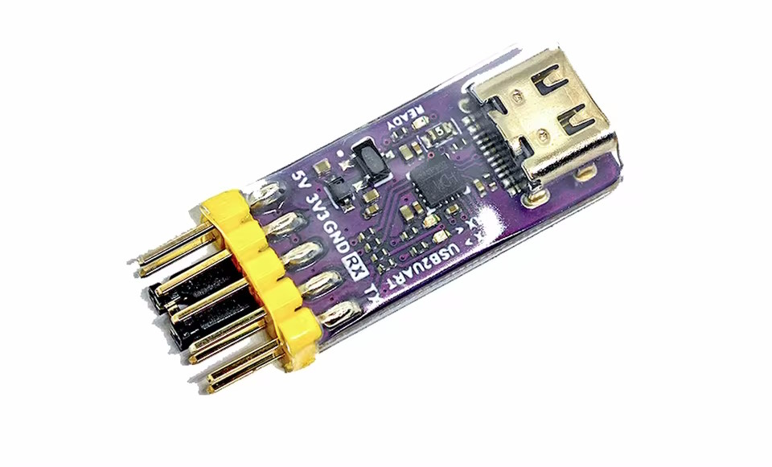
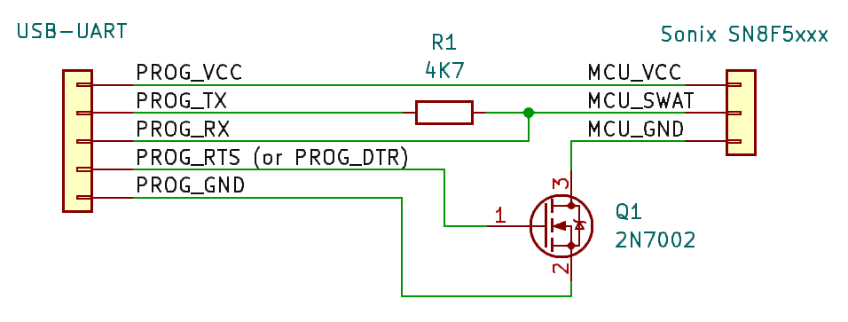
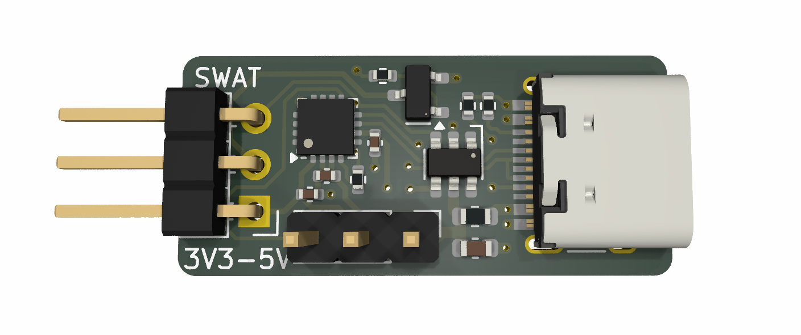

# SN8Flash

A command-line tool for flashing Sonix SN8F5xxx family of 8051-compatible microcontrollers using cheap USB-UART adapters

## Features

- Does all the usual operations:
  - Chip ID
  - Read
  - Erase/unprotect
  - Write
  - Verify
- Supports both main ROM and hidden boot parameter area
- Accepts firmware in raw binary and Intel HEX formats
- No expensive hardware required: just a cheap USB-UART dongle

## Supported chips

Currently tested with SN8F5701, SN8F5702, SN8F5703 and SN8F5829 series, but should work with many other chips in the family.

## Required hardware

SN8Flash uses cheap USB-UART dongles. Unfortunately, SN8F5xxx microcontrollers would only accept connections for a few milliseconds after reset, so a dongle with an exposed RTS or DTR signal is required for a hardware reset circuit. You may also use reset-less mode for dongles without RTS/DTR signals and reset the chip manually, but this mode is not reliable: a proper reset circuit is the best option.

I recommend this [CH343-based adapter](https://aliexpress.com/item/1005004399796277.html) (see all [tested adapters](https://github.com/silicagel777/SN8Flash/wiki/Tested-adapters) in the wiki):

And here is the connection circuit:

If you prefer dedicated hardware, check out [sonixflasher project by 
ebastler](https://github.com/ebastler/sonixflasher). It is a CH343-based adapter with the connection circuit built-in:

## Installation

Grab a binary from the [Releases](https://github.com/silicagel777/sn8flash/releases) section and you are ready to go! You may also want to add it to your `PATH` environment variable.

Alternatively, you can build SN8Flash from source. Install a recent [Rust toolchain](https://www.rust-lang.org/tools/install), then run `cargo build --release`.

## Usage examples

### General

- Run `sn8flash --help` to see all available commands and global parameters
- Run `sn8flash <command> --help` to see parameters for chosen command
- Global parameters go before command name (`--port` is a global parameter), command-specific parameters go after command name.
- Size and offset parameters accept additional formatting:
  - hex (`0x`) and binary (`0b`) prefixes
  - kilobyte (`k`) suffix
  - digit separators (`_`)

### Chip ID / connection check

- Run `sn8flash --port <PORT> chip-id` to read chip ID with the default connection settings
  - `<PORT>` is something like `COM7` for Windows or something like `/dev/ttyACM0` for Linux.
  - Default reset pin is RTS, you can switch to DTR by using `--reset-type dtr` global parameter.
  - You can also invert reset pin by using `--reset-invert` global parameter.
  - If your adapter does not have RTS/DTR outputs, use `--reset-less` global parameter to enable reset-less mode. SN8Flash will wait for you to reset the chip manually. This mode is not very reliable and may take a few tries to work.

### Read flash
- Run `sn8flash --port <PORT> read` to read flash.
    - Add `--size` to specify read size
    - Add `--offset` to read with offset
    - Add `--file <FILE_NAME>` to dump to a file instead of pretty-printing. Set `<FILE_NAME>` to `-` to dump to stdout.
    - Empty chips read as all `0xFF`s (or `0x00`s on SN8F5701)
    - Read-protected chips read as all `0x00`s, you'll have to erase them to unprotect.
    - You can use `--rom-bank boot` global parameter to read from hidden boot parameter area instead of main flash.
 
### Erase

- Run `sn8flash --port <PORT> erase` to perform chip erase.

### Write flash

- Run `sn8flash --port <PORT> write --file <FILE_NAME>` to flash new firmware
    - Supported firmware formats are raw binary and Intel HEX (`*.hex`, `*.ihex`, `*.ihx`).
    - `write` also implies `erase` and `verify` by default. Use `--no-erase` or `--no-verify` to skip these steps.

### Verify

- Run `sn8flash --port <PORT> verify --file <FILE_NAME>` to verify written firmware.
    - Most parameters are the same as for `write`.

## Notes on the programming protocol

- The protocol is single duplex UART with a non-standard baud rate of 750'000.
- Every command starts with `0x55` and has one or more bytes afterwards.
- Reading or writing outside of flash size wraps around.
- A lot of the protocol is just about sending 8051 opcodes for the chip to execute:
  - The documented "In-System Program" procedure from the datasheet is exactly how these chips are programmed from the PC.
  - But there is also some fun undocumented stuff! For example, there are hidden registers deep at the end of XRAM that are used to switch flash pages.
- There are at least two flash pages on these chips: main area and boot parameter area. The latter is interesting:
  - It is mostly undocumented, but some datasheets mention unique chip ID being stored there.
  - It can be read, erased and written just like the main area. But if you erase it, the chip won't leave bootloader mode and will never proceed to the main program. Make backups! SN8Flash won't allow erasing or writing it until you set a special flag.
  - Read protection does not affect boot parameter area.
  - The official "SN-Link ICP" software reads some values from the area, but I have no clue what it uses them for. It doesn't complain even if the area is completely wiped. Mystery everywhere!
